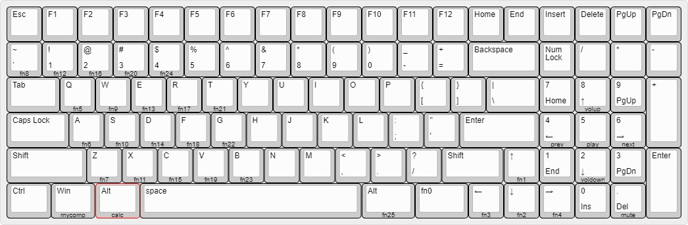

# Layouts for the Red Scarf III

## 6.25u Spacebar with Arrow Keys
This layout uses a 6.25u spacebar with arrow keys, full backlight and underlight controls and media buttons.  It merges livingspeedbump's [6.25u Spacebar w/ Arrow keys config](https://www.massdrop.com/talk/732/programming-the-red-scarf-keyboards) with [teawreks'](https://gist.github.com/teawrecks/e9d8f1b5b345e1d17f921dae72d642d9)
### Layout

### Instructions
Hold Fn and press:

Key | Function
--- | ---
Right Alt | Toggle backlighting
Right Arrow | Underlights on
Left Arrow | Underlights off
Up Arrow | Underlights increase brightness
Down Arrow | Underlights decrease brightness
1,2,3,4 | Light cycle modes
\` | White
Q,W,E,R,T | Red hues
A,S,D,F,G | Green hues
Z,X,C,V,B | Blue hues
Win | My Computer
Alt | Calculator
Num 2, 4, 5, 6, 8, Del | Media Keys
